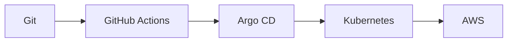

### Hi, I'm Matan 👋

DevOps Engineer building reliable cloud-native platforms on **AWS** and **Kubernetes** — from IaC and CI/CD to GitOps and observability.

[](https://matan.world)
[](https://www.develeap.com/author/matanavital/)
[](https://linkedin.com/in/matan-avital)
[](https://www.credly.com/users/matan-avital)

```bash
$ whoami
> DevOps Engineer @ Develeap

$ kubectl get certs --all-namespaces
> CKA · AWS SAP · AWS SAA · Terraform Associate · GitOps ×2 · GitHub Actions

$ echo $FOCUS
> Terraform · GitHub Actions · Kubernetes · cloud-native architectures
```

## ✍️ Writing @ Develeap

| Article | Topics |
| --- | --- |
| [How I Built a Multi-Account Deployment Dashboard When Traditional Monitoring Tools Fell Short](https://www.develeap.com/how-i-built-a-multi-account-deployment-dashboard-when-traditional-monitoring-tools-fell-short/matanavital/) | AWS · DynamoDB · GitHub Actions · Observability |
| [Stop Overpaying for S3: These Storage Tricks Can Cut Your AWS Bill Fast](https://www.develeap.com/stop-overpaying-for-s3-these-storage-tricks-can-cut-your-aws-bill-fast/matanavital/) | AWS · FinOps · S3 |
| [The Importance of Node Rotations, Image Tags, and a Good Piece of Cake](https://www.develeap.com/the-importance-of-node-rotations-image-tags-and-a-good-piece-of-cake/matanavital/) | Kubernetes · Containerization |

[All articles →](https://www.develeap.com/author/matanavital/)

## 🏆 Certifications

<div align="left">
  <a href="https://www.credly.com/org/the-linux-foundation/badge/cka-certified-kubernetes-administrator">
    
  </a>
  <a href="https://www.credly.com/org/amazon-web-services/badge/aws-certified-solutions-architect-professional">
    
  </a>
  <a href="https://www.credly.com/org/amazon-web-services/badge/aws-certified-solutions-architect-associate">
    
  </a>
  <a href="https://www.credly.com/org/hashicorp/badge/hashicorp-certified-terraform-associate-003">
    
  </a>
  <a href="https://www.credly.com/org/codefresh/badge/gitops-fundamentals">
    
  </a>
  <a href="https://www.credly.com/org/codefresh/badge/gitops-at-scale">
    
  </a>
  <a href="https://www.credly.com/org/github/badge/github-actions-certified">
    
  </a>
</div>

<table>
<tr>
<td valign="top" width="50%">

### 📊 GitHub Activity


</td>
<td valign="top" width="50%">

### 🛠️ Stack

**Cloud & Platform** — AWS · GCP · Kubernetes · Docker · Terraform

**CI/CD & GitOps** — GitHub Actions · Argo CD · Jenkins

**Languages** — Python · Shell · TypeScript · YAML



</td>
</tr>
</table>

## 🚀 Featured Projects

| Project | Description |
| --- | --- |
| [**portfolio**](https://github.com/MathoAvito/portfolio) | Next.js portfolio — [matan.world](https://matan.world) |
| [**dotfiles**](https://github.com/MathoAvito/dotfiles) | Ubuntu bootstrap & dev environment with chezmoi |
| [**link-harbor**](https://github.com/MathoAvito/link-harbor) | Self-hosted dashboard for organizing web links |
| [**aws-certifications**](https://github.com/MathoAvito/aws-certifications) | Hands-on labs and notes from AWS certification prep |

## 🎨 Beyond the terminal

💻 Custom PC builds · 🖨️ 3D printing · 🎵 Music

<div align="center">
  
</div>

## 🤝 Connect

[](https://linkedin.com/in/matan-avital)
[](mailto:matavital13@gmail.com)
[](https://open.spotify.com/user/vbl1z3x2ir2ox96ekku78322r)
[](https://www.instagram.com/3dmatho/)

<picture>
  <source media="(prefers-color-scheme: dark)" srcset="https://raw.githubusercontent.com/MathoAvito/MathoAvito/output/github-contribution-grid-snake-dark.svg">
  <source media="(prefers-color-scheme: light)" srcset="https://raw.githubusercontent.com/MathoAvito/MathoAvito/output/github-contribution-grid-snake.svg">
  
</picture>
